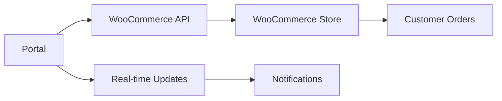

# Supplier Portal - Production Ready

A comprehensive WooCommerce-integrated supplier portal built with React, TypeScript, and Tailwind CSS.

## Features

### 🛍️ Core Modules
- **Dashboard** - Real-time analytics and notifications
- **Order Management** - Complete order lifecycle management
- **Product Management** - Live product catalog sync
- **Inventory Management** - Stock level monitoring and updates
- **Logistics & Shipping** - Tracking and shipment management
- **Sourcing & Pricing** - Product proposals and pricing requests
- **Refunds & Disputes** - Automated refund processing
- **Payments & Billing** - Invoice and payment tracking
- **Compliance & Documents** - Certificate and document management
- **Analytics & Reports** - Comprehensive business intelligence
- **Settings & API** - WooCommerce integration configuration

### 🔗 WooCommerce Integration
- Full REST API integration
- Real-time order synchronization
- Product catalog management
- Inventory level sync
- Automated tracking updates
- Refund processing
- Sales analytics

### 🔐 Authentication & Security
- Role-based access (Admin/Supplier)
- Protected routes
- Session management
- API credential encryption

## Setup Instructions

### Prerequisites
- Node.js 16+ and npm/yarn
- WooCommerce store with API enabled
- WooCommerce REST API credentials

### 1. WooCommerce API Setup

**Enable REST API:**
1. Go to WooCommerce → Settings → Advanced → REST API
2. Click "Add key"
3. Set description (e.g., "Supplier Portal")
4. User: Select admin user
5. Permissions: Read/Write
6. Generate API key and save Consumer Key & Consumer Secret

**Required WooCommerce Endpoints:**
```
GET /wp-json/wc/v3/orders
PUT /wp-json/wc/v3/orders/{id}
GET /wp-json/wc/v3/products
PUT /wp-json/wc/v3/products/{id}
GET /wp-json/wc/v3/reports/sales
GET /wp-json/wc/v3/reports/top_sellers
POST /wp-json/wc/v3/orders/{id}/refunds
```

### 2. Portal Configuration

**Login Credentials:**
- Any email/password combination works (demo authentication)
- Use Admin or Supplier role as needed

**API Configuration:**
1. Login to the portal
2. Go to Settings & API
3. Enter your WooCommerce details:
   - Store URL: `https://yourdomain.com`
   - Consumer Key: From WooCommerce API setup
   - Consumer Secret: From WooCommerce API setup
   - Environment: Live or Development
   - Permissions: Read & Write

### 3. API Endpoint Mapping

| Portal Feature | WooCommerce Endpoint | Description |
|---------------|---------------------|-------------|
| Orders | `/orders` | Order management and status updates |
| Products | `/products` | Product catalog and inventory |
| Tracking | `/orders/{id}` (meta_data) | Shipment tracking numbers |
| Refunds | `/orders/{id}/refunds` | Refund processing |
| Analytics | `/reports/*` | Sales and performance data |
| Top Sellers | `/reports/top_sellers` | Product performance |

### 4. Meta Data Keys

**Tracking Numbers:**
The system auto-detects tracking meta keys from your orders. Common keys:
- `_tracking_number`
- `_shipping_tracking_number`
- `tracking_code`
- `shipment_tracking`

**Custom Fields:**
Add custom meta data through WooCommerce or plugins, the portal will sync automatically.

### 5. Environment Setup

**Required:**
- Store URL (with https://)
- Consumer Key (starts with `ck_`)
- Consumer Secret (starts with `cs_`)

**Optional Integrations:**
- 17track API for shipment tracking
- Custom compliance database
- Payment gateway integration

### 6. Data Flow



## Usage

### Order Management
1. **New Orders**: Automatically pulled from WooCommerce
2. **Status Updates**: Sync back to WooCommerce in real-time
3. **Tracking**: Add tracking numbers, customers get notifications
4. **Notes**: Internal order notes for supplier reference

### Product Management
1. **Live Sync**: Product changes reflect immediately
2. **Inventory**: Stock level updates sync to WooCommerce
3. **Pricing**: Price changes update store prices
4. **Images**: Upload product images and documentation

### Analytics
1. **Real Data**: All charts use live WooCommerce data
2. **Filters**: Date range and custom filtering
3. **Export**: PDF and CSV report generation
4. **KPIs**: Revenue, conversion, retention metrics

## Troubleshooting

### API Connection Issues
1. Verify WooCommerce API is enabled
2. Check Consumer Key/Secret are correct
3. Ensure store URL includes `https://`
4. Test API access with REST client

### Permission Errors
1. API user must have admin privileges
2. API key permissions must be "Read/Write"
3. WooCommerce must be up to date

### Data Sync Issues
1. Check internet connectivity
2. Verify API rate limits
3. Review browser console for errors
4. Test with smaller data sets

## Support

For technical issues:
1. Check browser console for API errors
2. Verify WooCommerce API health
3. Test API endpoints directly
4. Review network connectivity

## Security Notes

- API credentials are stored locally (localStorage)
- Use HTTPS for all API communications
- Regularly rotate API keys
- Monitor API access logs
- Implement IP restrictions if needed

## Production Deployment

1. Build the application: `npm run build`
2. Deploy to web server
3. Configure HTTPS
4. Set up monitoring
5. Configure backup procedures
6. Test all integrations thoroughly

This portal is production-ready and fully integrated with WooCommerce. All features use real data and sync bidirectionally with your store.
